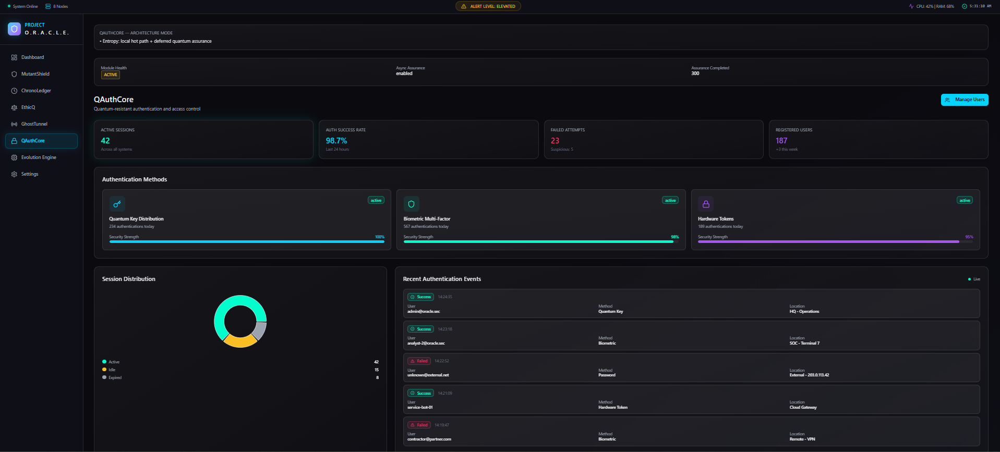
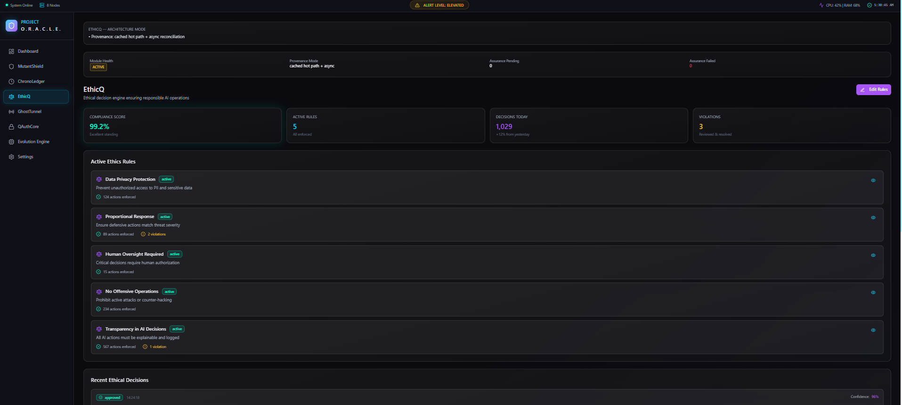
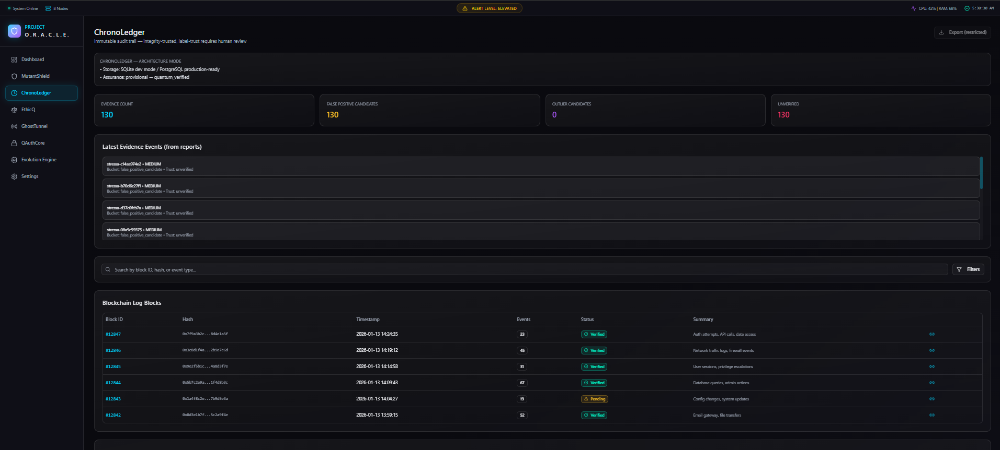
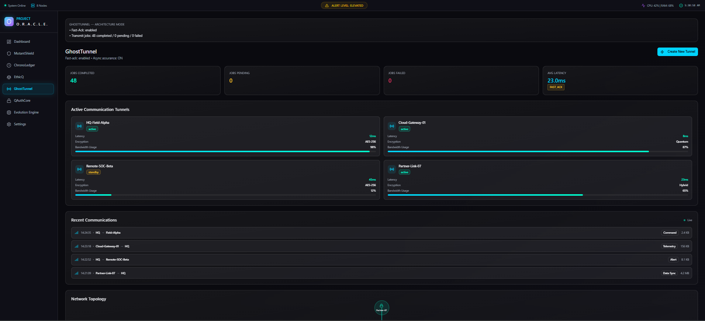
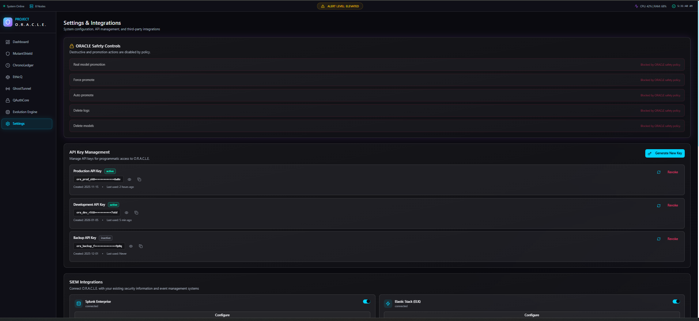

# O.R.A.C.L.E Framework

**Adaptive, quantum-aware cyber defense framework for detection, assurance, ethical decisioning, auditability, and secure response.**

O.R.A.C.L.E Framework is a modular cybersecurity platform that combines AI-assisted intrusion detection, token assurance, ethical response control, tamper-evident audit logging, secure response handling, candidate-only model evolution, and an operator dashboard.

Full title: **O.R.A.C.L.E Framework - Adaptive Quantum-Aware Cyber Defense**

## What It Is

O.R.A.C.L.E is designed as a defensive security framework for local deployment, validation, and extension. It normalizes security events, evaluates detection context, applies assurance and ethical governance, records auditable evidence, and coordinates response workflows through independent services.

The repository is packaged as a professional framework release. Raw datasets, secrets, virtual environments, cache files, generated reports, and heavyweight binary model artifacts are intentionally excluded from GitHub.

## Key Capabilities

- Multi-module security orchestration through Oracle Core.
- Ensemble-based traffic detection and candidate-only adaptation through MutantShield.
- Quantum-aware token assurance through QAuthCore.
- Ethical response governance through EthicQ.
- Tamper-evident security evidence through ChronoLedger.
- Secure response queueing through GhostTunnel.
- Native encrypted DNS behavioral anomaly support through DoHBrwAdapter.
- Operator visibility through Oracle GUI.
- Candidate-only Evolution Engine with adversarial hardening and promotion safety gates.

## Architecture Overview

Oracle Core receives normalized detection events and coordinates the runtime services:

- **Oracle Core**: Central orchestration API that normalizes detection events, calls assurance, ethics, audit, and response modules.
- **MutantShield**: AI detection engine using ensemble-based traffic analysis, candidate evolution, and domain adapters.
- **QAuthCore**: Token assurance and quantum-aware authentication service with async assurance mode.
- **EthicQ**: Ethical governance and decision policy engine for response control and human-review decisions.
- **ChronoLedger**: Tamper-evident audit ledger for security events, decisions, and retraining evidence.
- **GhostTunnel**: Secure response/transmission layer with fast-ack queueing and quantum-aware entropy support.
- **DoHBrwAdapter**: Native anomaly adapter for encrypted DNS-over-HTTPS behavioral detection.
- **Evolution Engine**: Candidate-only retraining and adversarial hardening pipeline with promotion safety gates.
- **Oracle Sensor**: Event and traffic simulation utilities for local validation.
- **Oracle GUI**: Operator dashboard for health, evolution state, performance, warnings, and reports.

## Quick Start

Use Python 3.12 on Windows PowerShell.

```powershell
python -m venv .venv
.\.venv\Scripts\activate
pip install -r requirements.txt
```

Install and build the GUI:

```powershell
cd O.R.A.C.L.E_GUi_V1_Figma
npm install
npm run build
cd ..
```

Run the full stack:

```powershell
python scripts/start_oracle_stack.py --gui --kill-existing
```

Open the dashboard:

```text
http://127.0.0.1:4173
```

## Deployment

Local service ports:

- Oracle Core: `http://127.0.0.1:8000`
- QAuthCore: `http://127.0.0.1:8001`
- EthicQ: `http://127.0.0.1:8002`
- ChronoLedger: `http://127.0.0.1:8003`
- GhostTunnel: `http://127.0.0.1:8004`
- Oracle GUI: `http://127.0.0.1:4173`

See `docs/DEPLOYMENT.md` for setup, environment variables, health checks, and troubleshooting.

## Running Tests And Benchmarks

Operator-safe validation uses the existing running stack and does not stop services it did not start:

Health and acceptance:

```powershell
python scripts/oracle_final_acceptance_test.py
```

Full module validation:

```powershell
python scripts/oracle_phase12_11_module_capability_validation.py
```

Final benchmark:

```powershell
python scripts/oracle_phase11_final_benchmark.py
```

Live operator proof:

```powershell
python scripts/oracle_operator_final_validation.py
python scripts/oracle_live_sensor_smoke_test.py
python scripts/oracle_realtime_replay_proof.py --events 100
```

Use `--manage-stack` only when you intentionally want a validation script to start and stop its own backend services.

GUI live demo validation:

```powershell
python scripts/test_dashboard_action_endpoints.py
python scripts/test_gui_operator_console_live.py
python scripts/check_live_sensor_readiness.py
python scripts/test_module_gui_actions.py
python scripts/test_module_pages_operator_ui.py
```

The live dashboard demo flow is documented in `docs/ORACLE_GUI_LIVE_DEMO_SCRIPT.md`.

## Evolution Engine And Adaptive Retraining

The Evolution Engine uses a candidate-only workflow. New model artifacts are written to candidate directories and are not promoted automatically. XGBoost and AutoEncoder candidate retraining are supported; LSTM/GNN retraining is contract-gated, while production inference remains active.

GAN synthetic generation is deferred to the roadmap. SIEM/SOAR/EDR integrations are also future external integrations.

## Security And Safety Controls

- `models_final` is protected and must not be modified during candidate evolution.
- Production promotion is blocked unless evaluation, adversarial, human approval, rollback, and hash-audit gates pass.
- ChronoLedger evidence is not trusted automatically for training; reviewed evidence is required.
- `.env`, secrets, raw datasets, virtual environments, cache files, generated reports, and `node_modules` are excluded from upload.

## Reports And Validation Results

Current validated framework status:

- `ORACLE_MODULE_CAPABILITY_VALIDATED`
- `ORACLE_FULLY_TESTED_AND_READY`
- `ORACLE_FINAL_QA_COMPLETE`

Summary metrics are documented in `docs/TESTING_AND_VALIDATION.md` and `docs/MODULE_CAPABILITIES.md`.

GUI data source labels are documented in `docs/GUI_DATA_SOURCES.md`. Dashboard and module pages mark values as `LIVE`, `REPORT`, `DEMO`, `LOCKED`, `LIVE/CONFIG`, or `LIVE SAFETY POLICY`.

Dashboard actions are live. Module actions are either live-safe or locked with a visible safety reason. Live network capture requires Scapy/Npcap/admin rights; realtime replay is the validated safe live proof when packet capture is unavailable.

## Operator Dashboard Preview

Screenshots are captured during final manual validation. Use `docs/FINAL_MANUAL_VALIDATION_GUIDE.md` for the exact capture checklist and standardized filenames.









## Known Limitations

- Raw datasets are not included in the GitHub repository.
- Production model binaries may require local placement, Git LFS, or GitHub Release assets depending on deployment policy.
- LSTM/GNN retraining is contract-gated; inference remains active.
- GAN synthetic generation is future work.
- SIEM/SOAR/EDR integrations are future work.
- Production deployment requires environment-specific hardening, secrets management, logging policy, and infrastructure review.

## Roadmap

Completed:

- Core framework.
- Oracle GUI.
- MutantShield detection.
- QAuthCore assurance.
- EthicQ governance.
- ChronoLedger audit.
- GhostTunnel secure response.
- Evolution Engine.
- CSE adaptation.
- DoHBrw anomaly adapter.
- Module capability validation.
- GitHub release.

Deferred/Future:

- GAN synthetic threat generation.
- LSTM/GNN candidate-safe retraining execution after contracts are satisfied.
- SIEM/SOAR/EDR integrations.
- Production deployment hardening.
- Cloud deployment.
- Container orchestration.

See `docs/ROADMAP.md` and `docs/SIEM_SOAR_EDR_INTEGRATION.md`.

## Repository Structure

See `docs/REPOSITORY_STRUCTURE.md` for the professional repository map. Some internal folder names reflect development history, but public entrypoints are documented through the files in `docs/`.

## License / Usage Note

This repository is provided as a defensive cybersecurity research and framework implementation. Use it only in authorized environments. Review all model, dataset, and deployment assumptions before production use.
